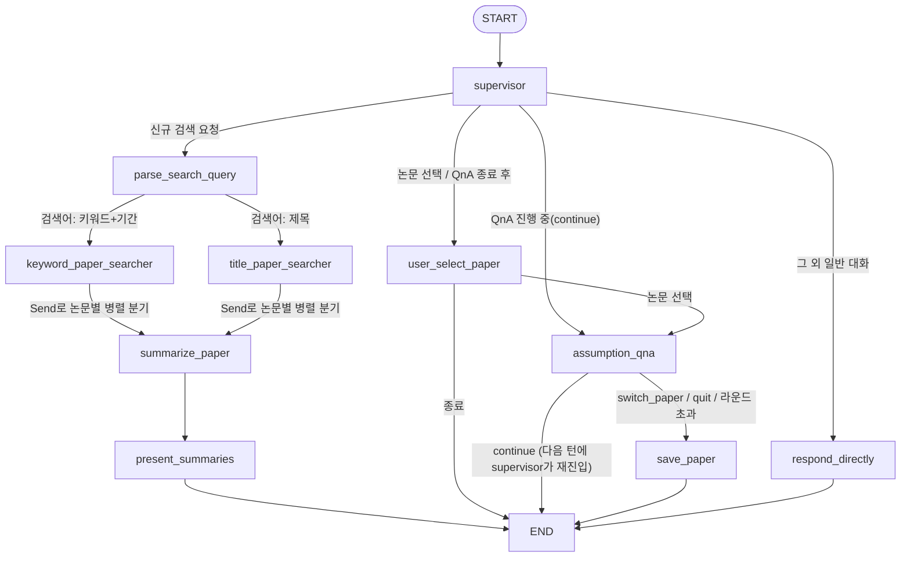
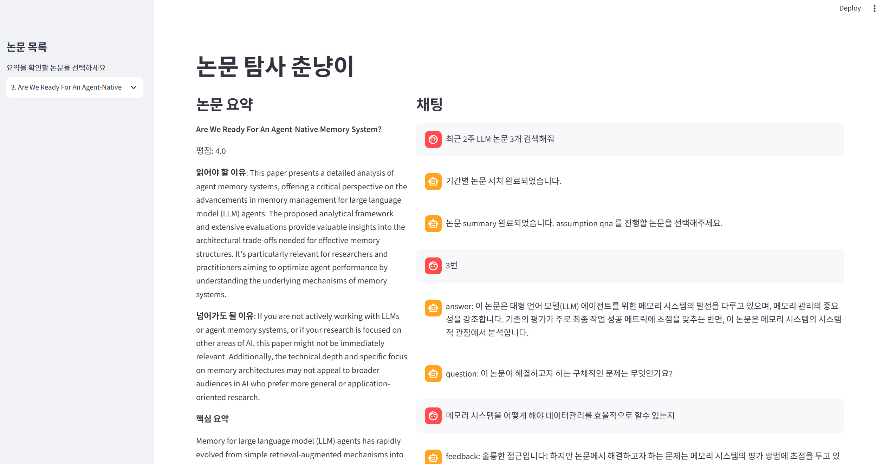

# 논문 탐사 에이전트 (Paper Exploration Agent)

## 목적

AI 기술은 빠르게 변화하며 새로운 논문가 지속적으로 발표된다.  
새로운 기술이 실제로 검토할 가치가 있는지 판단하고, 핵심 내용을 이해하는 과정에는 많은 시간과 노력이 필요하다.

이 에이전트는 최근 AI 논문를 탐색하고, 질문 기반으로 논문를 깊이 이해하도록 돕는다.

---

## 핵심 기능

1. **최근 AI 논문 탐색**
   - 사용자 조건에 맞는 최신 논문 검색
   - 추천도 및 메타데이터 기반 정렬

2. **논문 분석 및 질문**
   - 논문 내용 요약
   - 사용자의 사고를 유도하는 질문 생성
   - 답변에 따라 추가 질문 및 피드백 제공

3. **내용 저장**
   - 학습 결과 저장
   - graph 형식으로 키워드 저장 (paper_graph.json)

** 현재 title로 검색과 graph display기능은 아직 추가되지 않았습니다.**
** 검색어가 잘못된 경우 시스템종료가 필요합니다. ㅜ.ㅜ** 
---

## 그래프 구조

`supervisor`가 매 사용자 턴마다 라우팅을 담당.
다음 사용자 메시지가 들어오면 다시 `START → supervisor`부터 시작. QnA가 진행 중일 때는 `supervisor`가
`active_agent` / `qna_next_action` 상태(sticky routing)를 보고 LLM 라우팅 없이 곧바로 `assumption_qna`로 되돌려보낸다.

---

## 노드 설명

| Node | 역할 |
|------|------|
| `supervisor` | 매 턴 라우팅 담당. QnA가 진행 중이면(sticky routing) 우선 그 흐름을 유지하고, 아니면 LLM으로 `parse_search_query` / `user_select_paper` / `respond_directly` 중 하나를 선택 |
| `parse_search_query` | 사용자 요청에서 검색 방식(제목 vs 키워드+기간), 주제, 기간, 개수를 추출해 `keyword_paper_searcher` 또는 `title_paper_searcher`로 분기 |
| `keyword_paper_searcher` | 주제/기간 조건으로 Hugging Face에서 논문을 검색하고 점수 계산 후 정렬, 상위 N개를 `papers`에 저장 |
| `title_paper_searcher` | 제목 기반 검색 (현재 미구현 stub — 검색 대신 안내 메시지만 반환) |
| `summarize_paper` | `dispatch_summarizers`가 논문마다 `Send`로 병렬 실행. 각 논문의 평점, 요약, 읽어야/넘어가도 될 이유, 활용 아이디어를 구조화된 형태로 생성 |
| `present_summaries` | 병렬로 생성된 요약들을 id 순으로 정렬해 사용자에게 제시 |
| `user_select_paper` | 사용자의 응답에서 선택한 논문 번호 또는 종료 의도를 파싱해 `assumption_qna` 또는 `END`로 분기 |
| `assumption_qna` | 선택된 논문에 대해 질문-피드백-다음 질문을 반복하는 QnA 루프. `continue`면 이번 실행은 종료(다음 사용자 입력을 기다림), `switch_paper`/`quit` 또는 최대 라운드(`MAX_ASSUMPTION_ROUNDS`) 초과 시 `save_paper`로 이동 |
| `save_paper` | QnA 내용을 요약·키워드 추출해 markdown(`paper_qna/`)으로 저장하고, `paper_graph.json`에 키워드-논문 그래프를 누적 반영 |
| `respond_directly` | 검색/QnA와 무관한 일반 대화에 대해 LLM이 직접 응답 |
---

## 예시
