# Story Book Maker : Google adk

# 📖 완성된 그림책

## 페이지 1

> "어느 화창한 날, Mini는 하늘에 색색의 무지개를 보았습니다! 그것은 그녀의 마음을 호기심으로 설레게 했습니다."

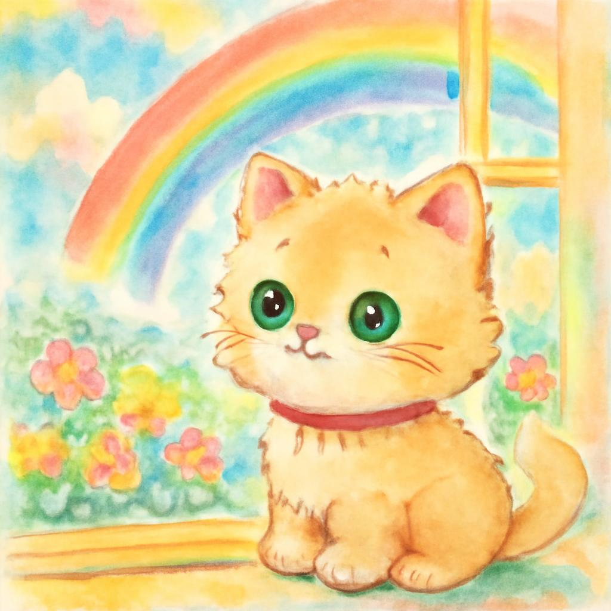

---

## 페이지 2

> "나는 어디에 닿는지 찾아야 해!" Mini가 결심하고 문을 쾅 열고 나갔습니다.

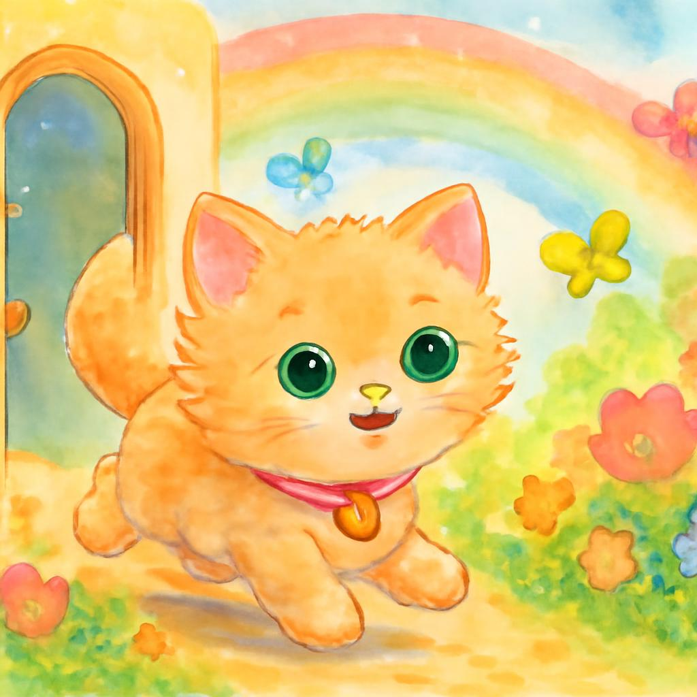

---

## 페이지 3

> "가는 길에 Mini는 지혜로운 늙은 거북이와 재잘거리는 새를 만났어요. '무지개 보러 가자!' 그들은 함께 말했습니다."

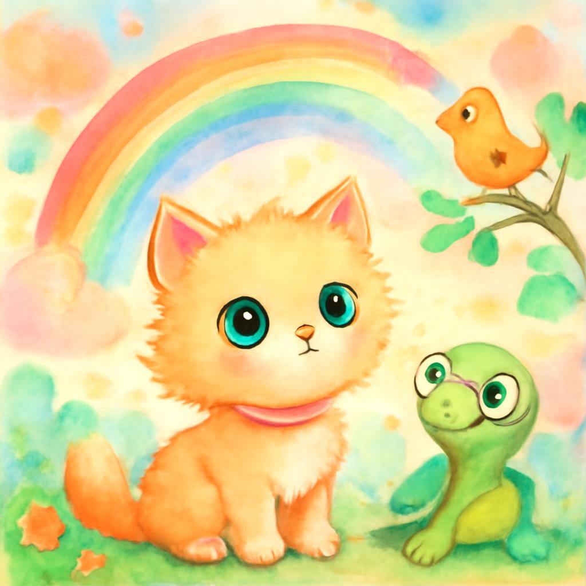

---

## 페이지 4

> "Mini는 친구와 이 순간을 나누는 기쁨을 깨달았습니다. 무지개는 그들처럼 아름다웠습니다!"

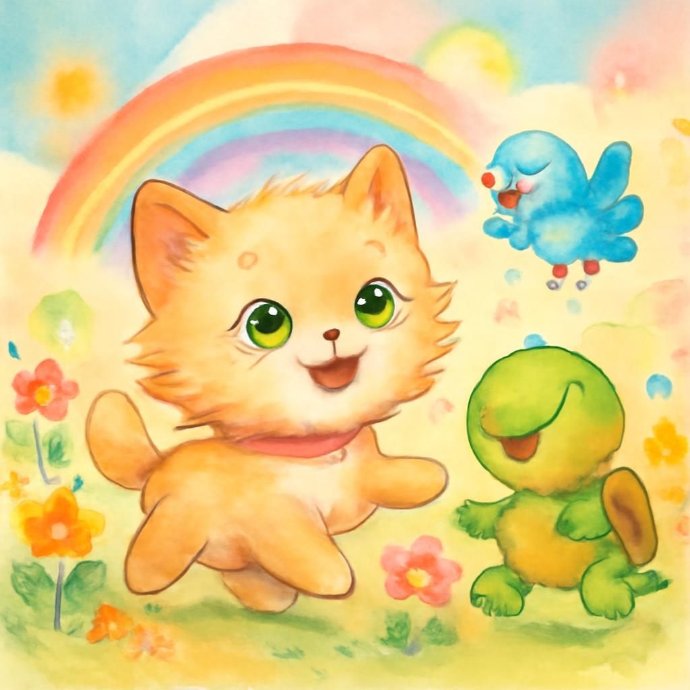

---

## 페이지 5

> "Mini는 무지개가 사라질 수 있지만, 그것이 주는 행복은 영원하다는 것을 배웠습니다. 무엇이 당신을 행복하게 하나요?"

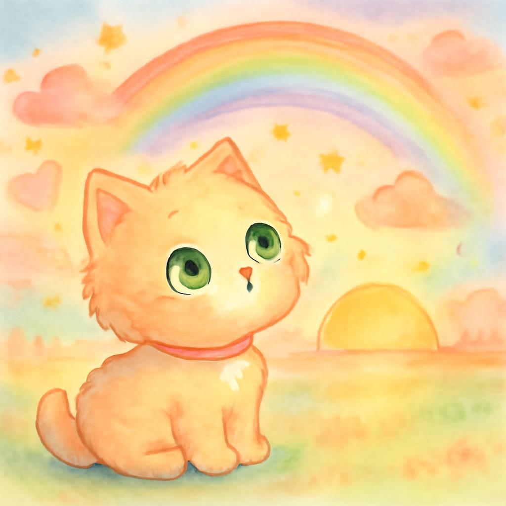

# 구조

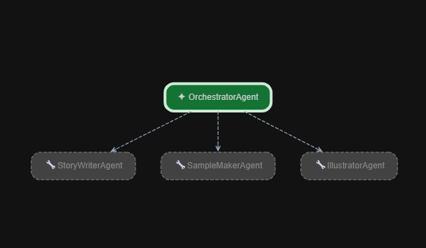

# ADK 결과

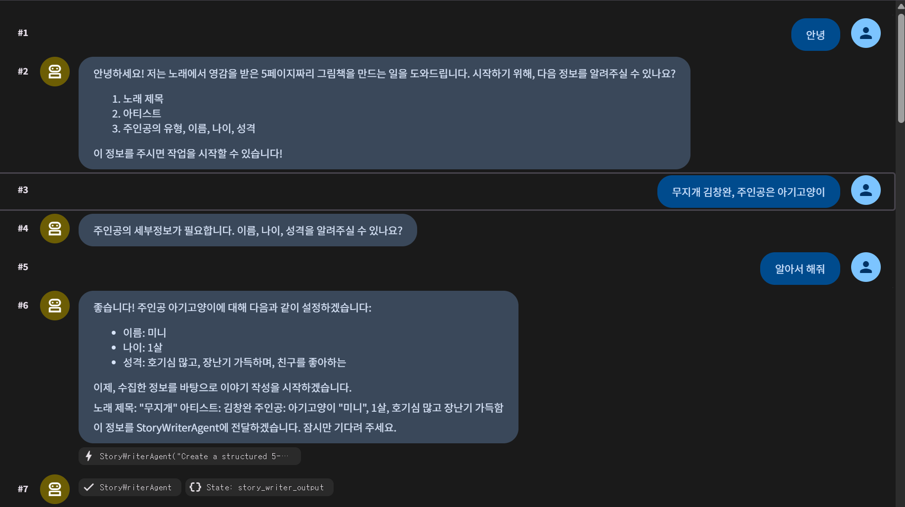

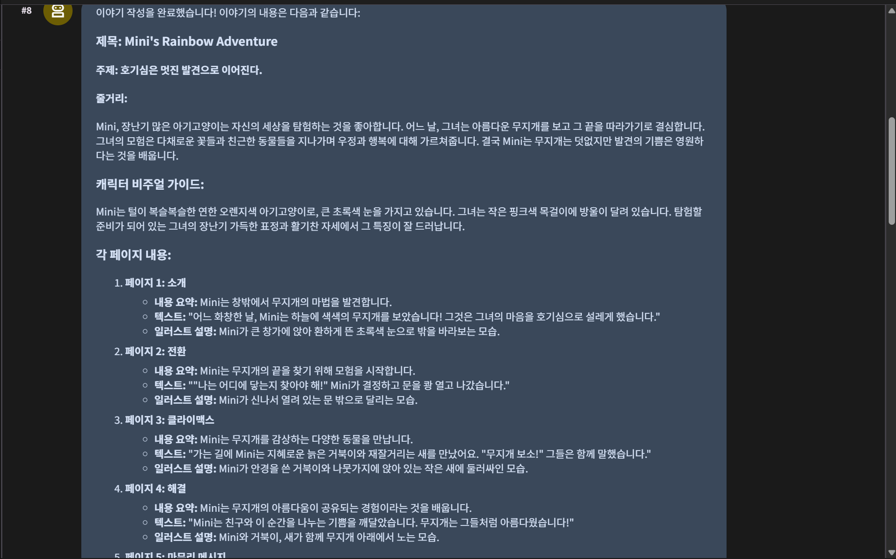

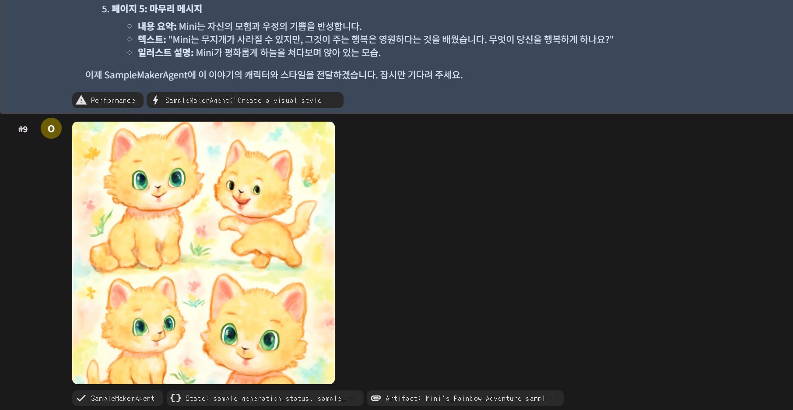

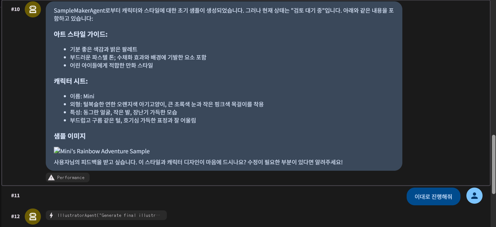

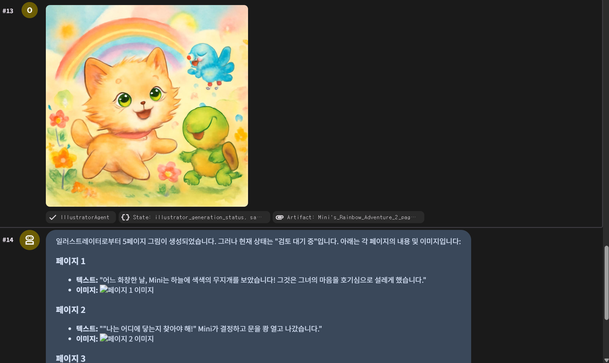